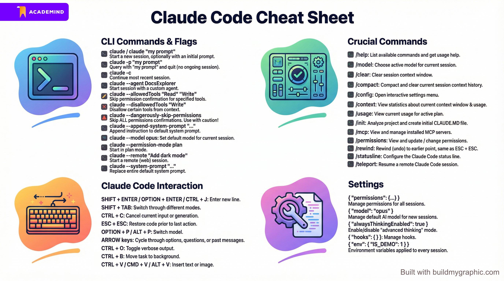

/quit

/usage

/context

'''Bash
claude -p "explain this project"
'''

* 背景執行

```Bash
claude "檢查當前目錄下是否有未使用的 page.tsx 檔案" -p
```

* 接續上次對話

```Bash
claude -c
```

### 檔案架構亮點概覽：
1. **開發環境與多元整合介面**：涵蓋 CLI 基礎、VS Code 官方擴充功能（Diff 比對、Focus Input）及桌面/行動版 App（遠端派遣）。
2. **核心斜線指令（Slash Commands）**：以表格化整理 `/config`, `/model`, `/context`, `/compact`, `/clear`, `/resume`, `/usage` 的功能與適用情境。
3. **設定層級與覆蓋邏輯**：清晰對比全域、專案（進 Git）及本地（不進 Git）設定檔的優先順序。
4. **權限管理機制與安全防線**：深入拆解逐步確認、自動接受修改與 `--dangerously-skip-permissions` 危險全權模式，並強調防範 `.env` 密鑰洩漏的最佳實踐。
5. **上下文記憶（Token）管理與進階心法**：詳解背景自動壓縮機制、初始 Token 預載結構，以及高級開發者的兩大「重啟與平行分流」黃金心法。
6. **快捷啟動與高效工作流**：列出如何使用單次即時提示詞、背景不開 CLI 的 `-p` 旗標（Print Mode）與快速接續上一次進度的 `-c` 旗標。

<br>

### Claude Code 的權限管理機制：

1. **運作機制：** 啟動後系統會跳出警告，一旦確認，Claude Code 將跳過所有權限請求，AI 提出的任何讀寫與 Bash 指令都會被無條件執行。  

2. **潛在風險：** 雖然 Claude Code 的預設活動範圍被限制在你的專案目錄內，但如果 AI 在專案中生成並執行了一個惡意 Bash 腳本（例如清空硬碟、刪除整個 Git 歷史紀錄，或透過腳本在專案外進行不當操作），它將會直接執行成功並摧毀你的開發環境或機器。 

3. **最佳建議：** 雖然這個功能在大工作量的自動化情境下非常方便，但請務必在完全信任專案環境且做好版控備份的前提下，謹慎使用。

<br><br>

# Claude Code 進階安全防線：Docker Sandbox 沙盒隔離指南

在啟用全自動化「全權放行危險模式（`--dangerously-skip-permissions`）」時，為了兼顧極致的開發效率與實體主機的安全性，利用 **Docker Sandbox** 建立隔離環境是目前最佳的解決方案。

---

## 一、 什麼是 Docker Sandbox 模式？

* **運作原理**：如果你的實體電腦上已經安裝並啟動了 Docker 引擎，你就可以利用 Docker 相對較新推出的 **Sandbox（沙盒）功能**。
* **動態環境建立**：系統會在背後為你**動態、即時地建立一個完全獨立的虛擬隔離沙盒環境**。
* **專案自動包裝**：Docker 會自動將你目前本地正在編寫的專案目錄包裝並映射（Map）到該沙盒中，讓 Claude Code 在這個完全封閉的內部環境中啟動與執行。

---

## 二、 沙盒環境下的「安全自動化」優勢

* **預設跳過權限限制**：當你在 Docker Sandbox 中啟動時，Claude Code **預設就會直接以「全權放行/繞過所有權限請求」的模式執行**。
* **實體主機的防彈衣**：在沙盒內部，AI 雖然擁有最高级别的自動化工具執行權限，但**它絕對無法跨越沙盒邊界去碰觸你真正的實體電腦系統**。
* **極端災難防禦**：即便 AI 在執行複雜任務時，不小心（或錯誤地）生成並執行了一個具毀滅性的惡意 Bash 腳本（例如清空硬碟），**被摧毀的也只有那層虛擬的沙盒環境，完全不會外洩影響到你外部的實體機器**。

---

## 三、 實戰操作與注意事項

### 1. 初次啟動的環境初始化
* 由於進入 Docker Sandbox 等同於切換到一個「全新、乾淨、獨立的系統環境」，因此初次在沙盒中執行時，你必須在裡面**重新走一遍 Claude Code 的聯網、身份驗證與登入流程**。

### 2. 專案級別的版控風險依然存在
* **Git 紀錄防護**：雖然你的實體硬碟安全無虞，但因為專案檔案與 Git 倉庫被映射進了沙盒，Claude Code 依然有能力在沙盒內搞砸、甚至抹除你的 Git Commit 歷史紀錄。
* **最佳實踐**：在使用全權自動化時，**基本的本地或遠端版控備份依然不可忽略**。

### 3. 完整功能與指令支援
* 在 Docker 沙盒環境中，你依然可以無縫使用所有先前學過的 Claude Code 命令列參數與旗標（例如用於背景單次執行並輸出答案的 `-p` 旗標等）。

---

> 💡 **核心工作流總結：**
> 當你需要處理高工作量、需要讓 AI 一口氣執行多輪 Bash 指令並重構大量程式碼的任務，而你想離開座位去休息時，**「Docker Sandbox + 權限自動跳過」**能讓你放心地將完全控制權交給 AI，是兼顧極致效率與系統安全的業界高級操作標準！


<br><br>

# 災難復原與程式碼回滾（Revert & Undo）

## 1. 第一道防線：Git 版本控制系統（至關重要）

無論有沒有使用 AI，版本控制都是開發標配；但在與 AI 協作時，Git 的重要性呈指數級改進。  

### 頻繁提交 Commit： 
由於 AI 有可能大範圍修改你的程式碼、甚至誤刪檔案，養成「頻繁提交小 Snapshot」的習慣能讓你隨時有安全落腳點可以還原。  

### 善用 IDE Diff 工具： 
搭配 Visual Studio Code 等編輯器，你可以透過內建的 Git Diff 介面，逐行審視 AI 到底動了哪些地方。這能讓 Review AI 程式碼的過程變得非常視覺化且輕鬆。  

<br>

## 2. 第二道防線：Claude Code 內建的「時空倒流（Rewind）」功能(不穩定)

除了依賴 Git，Claude Code 本身也提供了一套內建的復原機制（雖然它無法取代版本控制，但適合作為即時修正的輔助工具）：

### 方法 A：連按兩次 Escape 鍵 (Esc + Esc)
當 AI 剛完成一項修改而你不滿意時，快速連按兩次 Esc，終端機會跳出 Rewind? Restore the code? 的提示。此時你可以自由選擇要將程式碼還原到哪個時間點（例如：還原到本次對話的最開始處）。  

### 方法 B：使用斜線指令 /rewind
在互動視窗中輸入 /rewind，同樣會開啟時光倒流選單，讓你選擇想要回滾的工作階段（Session）。  

<br><br>



<br><br>

# Claude Code 終極速查手冊：CLI 參數、快捷鍵與設定全指南

在多數開發情境下，Claude Code 的預設值已足夠應付需求，但在**權限控管（例如防止 AI 讀取 `.env` 檔案）**、**沙盒配置**或**進階自動化**時，靈活運用核心參數與指令將大幅提升生產力。

<br>

## 一、 命令列參數與旗標（CLI Commands & Flags）

這些是在終端機（Terminal）啟動 `claude` 時可以附加的參數與旗標：

| 語法指令 | 功能描述 |
| :--- | :--- |
| `claude` 或 `claude "my prompt"` | 啟動全新的互動式 Claude Code 工作階段，可選填初始提示詞。 |
| `claude -p "my prompt"` | **單次查詢**：執行完該提示詞的任務後直接退出，不保持 Ongoing 工作階段。 |
| `claude -c` | 續接（Continue）上一次最近執行的對話工作階段。 |
| `claude --agent DocsExplorer` | 使用自訂代理人（Custom Agent）啟動工作階段（例如文件探索器）。 |
| `claude --allowedTools "Read" "Write"` | **工具白名單**：對指定的工具權限直接放行，跳過確認彈窗。 |
| `claude --disallowedTools "Write"` | **工具黑名單**：直接閹割指定工具，將其自上下文移除（AI 將完全不知道有此工具）。 |
| `claude --dangerously-skip-permissions` | **全權放行**：跳過所有工具的權限確認。**請極其謹慎使用！** |
| `claude --append-system-prompt "內容"` | 在預設系統提示詞後**追加**指令（適用於單次工作階段的臨時規範）。 |
| `claude --system-prompt "內容"` | **完全覆蓋**預設系統提示詞，改用全自訂的角色定義（例如：You are a React.js expert）。 |
| `claude --model opus` | 為當前工作階段指定預設的 AI 模型（如需可用模型清單請參閱官方列表）。 |
| `claude --permission-mode plan` | 以「計劃模式（Plan Mode）」啟動工作階段（預設為會詢問權限的 default 模式）。 |
| `claude --remote "Add dark mode"` | 啟動遠端網頁（Web）工作階段。 |

<br>

## 二、 執行中快捷鍵與操作（Claude Code Interaction）

在 Claude Code 的互動視窗內執行任務時，可利用以下快捷鍵進行即時控制：

### 1. 輸入與導覽
* `SHIFT + ENTER` / `OPTION + ENTER` / `CTRL + J`：在輸入框內**換行**（確切指令依作業系統與終端機軟體而異）。
* `方向鍵 上 / 下`：循環切換、查看過去輸入過的歷史訊息（Past messages）。
* `方向鍵 左 / 右`：在系統提問或選項選單中橫向切換。
* `CTRL + V` / `CMD + V` / `ALT + V`：直接將文字或**圖片**剪貼簿內容插入到提示詞中。

### 2. 任務中斷與恢復
* `CTRL + C`：取消當前正在輸入的文字或正在生成的任務。
* `ESC`：中止當前 AI 的生成（適合在 AI 走錯方向時**及時介入並補入新提示詞**）。
* `ESC + ESC`：**時空倒流**，將程式碼還原到 AI 上一次執行動作前的狀態（同 `/rewind`）。

### 3. 狀態與模式切換
* `SHIFT + TAB`：在不同的權限模式間快速切換（`default` 預設、`write permissions` 自動寫入、`plan` 計劃模式）。
* `OPTION + P` / `ALT + P`：在對話中快速**切換 AI 模型**（就算提示詞寫到一半也能即時換）。
* `CTRL + O`：切換詳細輸出模式（Toggle verbose output），決定是否顯示更多底層執行細節。
* `CTRL + B`：將當前任務推送到**背景執行**（註：Claude 在執行探索型任務時通常會聰明地自動轉背景）。

<br>

## 三、 核心斜線指令（Crucial Commands）

在對話框中輸入以 `/` 開頭的指令，可以直接調用系統功能：

* **`/help`**：叫出使用說明書，列出所有可用指令與說明。
* **`/config`**：開啟互動式的設定選單。
* **`/model`**：變更目前工作階段所使用的 AI 模型。
* **`/permissions`**：檢視並即時更新/修改當前的工具授權權限。
* **`/rewind`**：時光倒流（程式碼回滾），效果等同於連按兩次 `ESC`。
* **`/clear`**：清空目前對話的上下文視窗（等同於重開一個全新的工作階段）。
* **`/compact`**：將目前的對話歷史進行**壓縮（摘要化）**，隨後清空上下文以節省 Token。
* **`/context`**：查看當前 Token 上下文視窗（Context Window）的詳細使用量與統計。
* **`/usage`**：查詢目前方案的用量進度（距離下一次額度重置還剩多少）。
* **`/init`**：自動分析當前專案並建立初始的 `CLAUDE.MD` 規範檔案。
* **`/mcp`**：查看並管理目前專案已安裝的 MCP（Model Context Protocol）伺服器。
* **`/statusline`**：自訂與配置終端機底部 Claude Code 的狀態欄顯示。
* **`/teleport`**：恢復並接管遠端的 Claude Code 工作階段。

<br>

## 四、 設定檔配置（Settings 結構）

你可以透過互動式的 `/config` 選單進行調整，或是直接編輯全域、專案級別或本地（不進 Git 版控）的 `settings.json` 檔案。以下為核心配置欄位範例：

```json
{
  // 1. 權限管控：管理所有工作階段的工具權限與黑白名單
  "permissions": { ... }, 

  // 2. 預設模型：新工作階段啟動時預設使用的 AI 模型 (例如：opus)
  "model": "opus", 

  // 3. 進階思考：是否開啟「進階思考模式（Advanced Thinking）」，預設為 true。關閉可能顯著降低生成品質
  "alwaysThinkingEnabled": true, 

  // 4. 環境變數：自動注入並套用到每一個對話 Session 中的環境變數
  "env": { 
    "IS_DEMO": 1 
  },

  // 5. 自動化鉤子：管理專案生命週期中的自動化 Hooks
  "hooks": { ... } 
}