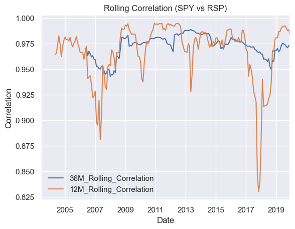

# 量化輪動交易系統研發筆記

## 導論與核心架構

本課程旨在利用 Python (Google Colab) 建立一個**資產配對輪動交易策略（Asset Pair Rotation Strategy）**。
透過統計學指標捕捉市場風格的切換，在標普 500 的兩種不同編製架構 ETF 之間動態輪動，以獲取超越大盤的 **Alpha（超額回報）**。

### 核心策略研發 6 大步驟 (Workflow)
1. **探索性數據分析 (EDA)：** 觀察資產的歷史行為與大趨勢。
2. **定義動態關係：** 利用滾動報酬率與 Z-Score 捕捉相對強弱。
3. **制定交易規則 (Trading Rules)：** 確立明確的資產切換訊號。
4. **加入防禦機制 (Volatility Overlay)：** 引入波動率濾網，在極端市場中動態避險。
5. **歷史回測 (Backtesting)：** 在歷史數據中模擬策略表現，嚴格切分訓練集與測試集。
6. **績效多維度評估：** 對抗基準（Benchmark），檢驗夏普值與最大回撤的穩定度。

---

## 交易標的對決：SPY vs. RSP

策略的獲利根基來自於兩者**「指數編製機制」**的根本差異：

### 1. SPY (Standard & Poor's Depository Receipts)
* **全名：** SPDR S&P 500 ETF Trust（市值加權）
* **機制：** 公司市值越高，權重越大。
* **特性：** 本質上偏向**「動能策略（Momentum）」**。在牛市後期、由少數科技巨頭（如 FANG、Mega-caps）領漲的集中行情中表現極佳。
* **缺點：** 風險高度集中於少數權值股，當市場面臨高估值修正時，回撤較為劇烈。

### 2. RSP (Rebalanced S&P)
* **全名：** Invesco S&P 500 Equal Weight ETF（等權重）
* **機制：** 500 檔成分股無論大小，權重一律平等（各佔約 0.2%），每季定期再平衡。
* **特性：** 隱含**「低買高賣」**的反向操作機制。更能反映中小型股（Mid/Small-caps）的真實廣度。
* **特性：** 當市場呈現普漲行情，或資金從科技巨頭撤出並輪動到其他板塊時，表現優於 SPY。

> **量化思維訓練：** 
> 不要盲目爭論誰比較「好（Better）」。任何投資評估都必須建立在「特定情境（Context）」與「時間週期（Time Period）」之上。量化交易者的任務是找出「什麼時候該持有誰」。

---

## 核心量化數學公式

### 1. 累積報酬率 (Cumulative Return)
衡量從固定起點到終點的總增長：
$$\text{Cumulative Return} = \frac{P_{end} - P_{start}}{P_{start}}$$

### 2. 年化滾動報酬率 (Annualized Rolling Return)
將長度為 $h$ 的移動視窗總報酬，換算成平均每年回報率。在連續對數回報下表示為：
$$R_t(h) = \ln(P_t) - \ln(P_{t-h})$$

若為簡單報酬率的年化計算：
$$\text{Annualized Return} = (1 + \text{Total Return})^{\frac{\text{Periods Per Year}}{\text{Total Window Period}}} - 1$$

### 3. 滾動相關係數 (Rolling Correlation)
在時間點 $t$、視窗長度為 $k$ 下，動態觀測兩資產關係如何隨時間演變（值介於 -1 到 +1 之間）：
$$\rho_{t,k} = \frac{\text{Cov}(X_{t-k:t}, Y_{t-k:t})}{\sigma_{X_{t-k:t}} \sigma_{Y_{t-k:t}}}$$

# 量化金融核心指標解析：累積報酬率 vs 年化滾動報酬率

在量化交易、策略回測與資產評估中，**累積報酬率**與**年化滾動報酬率**是最常被提及的兩個核心績效指標。然而，這兩個指標的計算維度、關注焦點以及應用場景有著本質上的不同。

簡單來說：**累積報酬率看的是「終點有多遠」（大局），而年化滾動報酬率看的是「沿途穩不穩」（細節）。**

---

## 一分鐘核心對比表

| 評估維度 | 累積報酬率 (Cumulative Return) | 年化滾動報酬率 (Annualized Rolling Return) |
| :--- | :--- | :--- |
| **核心定義** | 資產在**整個指定期間**（從固定起點到固定終點）的總增長率。 | 將**特定長度（如3年）的移動視窗**內之報酬率，換算成「平均每年」的複利回報。 |
| **時間軸特徵** | **靜態的點對點**（固定起點 $P_{start}$ 與終點 $P_{end}$）。 | **動態的滑動區間**（隨著時間天天往後滾動）。 |
| **主要功能** | 呈現資產最終幫投資人賺了多少總資產倍數（總成績單）。 | 呈現策略在歷史任意時間點進場的長期**勝率、穩定度與投資體驗**。 |
| **指標盲點** | 容易受到**進場時機（幸運或倒楣）**的極端影響，掩蓋了中途的巨大回撤。 | 計算較為複雜，且圖表呈現的是一條波動曲線，需要進一步做統計（如勝率）才好解讀。 |

---

## 指標深度拆解

### 1. 累積報酬率 (Cumulative Return) —— 點對點的終極成績單

累積報酬率就像是跑馬拉松，它不管投資人中途抽筋了幾次、跌倒了幾遍，它**只關心你到達終點時，總共前進了多少距離**。

*   **數學公式：**
    $$\text{Cumulative Return} = \frac{P_{end} - P_{start}}{P_{start}}$$
*   **直觀範例：** 
    投資人在 2020 年 1 月 1 日投入 100 萬元買入 SPY，到了 2026 年 1 月 1 日，這筆資產變成了 180 萬元。這 6 年間的累積報酬率就是 $80\%$。
*   **量化陷阱（起點偏誤 / Look-back Bias）：**
    假設同時期有另一個策略 B 的累積報酬率高達 $100\%$。單看累積報酬率，會讓人覺得策略 B 比較好。但真實歷史是，策略 B 在 2022 年曾經讓資產暴跌了 $70\%$（最大回撤劇烈）。如果某位客戶不幸在 2022 年初進場，他的真實投資體驗將會是一場災難。

<br>

### 2. 年化滾動報酬率 (Annualized Rolling Return) —— 移動視窗的生存體檢表

年化滾動報酬率是為了解決累積報酬率的「進場時機盲點」。它不再綁定某個固定的歷史開始日期，而是**假設投資人在過去歷史中的「任意一天」進場，並持有固定的時間週期（例如 3 年）**，然後把這 3 年的總回報縮小成「平均每年」賺幾 %。


*   **數學公式：**
    $$\text{Annualized Return} = (1 + \text{Total Return})^{\frac{\text{Periods Per Year}}{\text{Total Window Period}}} - 1$$
*   **直觀範例（以 3 年日資料滾動為例）：**
    一個 3 年（756 個交易日）的滑動長方形視窗在歷史時間軸上天天往右移：
    *   **視窗 A（2020-2023）：** 3 年總共賺 $60\%$ $\rightarrow$ 換算成年化複利約 $16.96\%$。
    *   **視窗 B（2021-2024）：** 3 年總共賺 $40\%$ $\rightarrow$ 換算成年化複利約 $11.87\%$。
    *   **視窗 C（2022-2025）：** 3 年遇到海嘯總共虧 $-5\%$ $\rightarrow$ 換算成年化複利約 $-1.69\%$。

將這些天天滾動算出來的「年化點」連成一條連續曲線，就是年化滾動報酬率圖表。

---

## 💡 為什麼量化交易員更看重「年化滾動報酬率」？

在開發如 **SPY（市值加權） vs RSP（等權重）** 的輪動策略時，若只看累積報酬率，容易得出「RSP 最終總回報賺比較多，所以盲買 RSP 就好」的粗糙結論。但當我們引入**3年年化滾動報酬率**並統計所有滾動區間後，會發現以下關鍵事實：

1.  **破解時機迷思（真實勝率）：** 
    數據統計顯示，RSP 超越 SPY 的時間點（勝率）其實只有 **50% 左右**。這代表兩者的風格輪動在歷史上是非常均衡的，沒有誰絕對壓倒誰，進而確立了開發「動態輪動策略」的必要性。
2.  **看清極端風險（天花板與地板）：**
    *   **SPY** 的年化滾動報酬率大約落在 $-4.5\% \sim 28.5\%$ 之間。
    *   **RSP** 的年化滾動報酬率大約落在 $-6.8\% \sim 36.0\%$ 之間。
    這組數據揭露了 RSP 具備高 Beta 的中小型股特徵：雖然在牛市時的「天花板（最高 36%）」比 SPY 高，但在熊市時的「地板（最低 -6.8%）」也跌得比 SPY 更深。

---

## 總結與應用場景

*   **累積報酬率：** 適合用於向客戶或主管展示**「長期持有的最終總資產翻了幾倍」**的最終成果展示。
*   **年化滾動報酬率：** 適合用於**策略研發與風險管理**。當你想評估一個策略在不同景氣循環下的穩定度、真實超額勝率，以及極端市況下的承受能力時，必須使用年化滾動報酬率。

<br><br>

---


# 量化輪動交易系統研發筆記：Lecture 4

## 本堂核心觀念 (Key Insights)

1. **探索性數據分析 (EDA) 的視覺化目的：**
   單看累積報酬率（Cumulative Returns）容易產生盲點，因為它只呈現了歷史最終累積的「點」。而**滾動報酬率（Rolling Returns）**能將歷史展開，呈現出「誰在什麼時候勝出、勝出的頻率與幅度如何」的動態過程，這是捕捉市場風格切換、尋找 Alpha 訊號的關鍵。

2. **黃金滾動週期 (The Goldilocks Zone)：**
   課程中選擇 **3 年（756 個交易日）** 作為觀測風格輪動的基準。
   * **原因：** 3 年期是一個「不長不短剛剛好」的區間。它能有效過濾掉幾週或幾個月的短期市場雜訊（Market Noise），同時又不會像 5 年或 10 年那樣過於滯後，完美契合美股 3~5 年的景氣與風格切換週期。

3. **堅持「函數化」架構 (Function-Based Coding)：**
   在量化研發中，所有的運算與繪圖都應封裝成函數（Function），以確保程式碼具備：
   * **可重複性 (Reproducible)：** 未來若想切換為 1 年、5 年滾動週期，只需更改輸入參數，不需重寫核心程式。
   * **整潔度 (Clean Code)：** 讓主腳本邏輯保持清晰、便於維護。

4. **動態高亮顯示例（Line Highlighting via Alpha）：**
   在多條線條交織的量化圖表中，直接閱讀容易產生視覺混亂。利用 `alpha`（透明度）參數，將非核心資產調淡（例如 `alpha=0.5`），同時讓主要觀察目標保持 `alpha=1`（實色粗線），這在量化簡報與數據說故事（Storytelling）中是非常強大的視覺化技巧。

<br><br>

---


# 量化輪動交易系統研發筆記：Lecture 5

## 本堂核心觀念 (Key Insights)

1. **破除「誰比較好」的量化迷思：**
   雖然從 2003 年到目前的「累積報酬率」來看，等權重的 RSP 最終總報酬高於 SPY，但這很容易讓人產生「RSP 必然優於 SPY」的盲點。量化交易員必須用具體的統計數據與情境來定義強弱，而非單看一個最終結果。

2. **多維度滾動體驗 (Investor Experience Analysis)：**
   在實際業務或策略研發中，投資人不可能都在 2003 年的同一天進場。在這 21 年的歷史中（以日資料計算），共包含 **4,678 個不同的 3 年滾動期**。
   * 透過統計這 4,678 個區間的表現，我們才能真正了解：「在歷史任意一天盲測進場並持有 3 年，投資人的真實體驗與勝率分佈為何」。

3. **驚人的統計結果 —— 50/50 賽局：**
   經由數據統計算出，RSP 超越基準（SPY）的時間百分比大約只有 **50% 左右**。這代表在任意時間點進場持有 3 年，兩者誰會勝出**純粹是擲硬幣（Coin Toss）**的隨機表現。這也用數據證實了：美股在「大盤動能領漲（SPY）」與「均值回歸/百花齊放（RSP）」兩大風格間存在均衡的輪動，進而確立了開發「動態輪動策略」的必要性。

4. **利用「向量廣播（Broadcasting）」優化運算：**
   在比較 `df_rolling[col] > df_rolling[benchmark]` 時，Pandas 會自動在底層進行向量化廣播運算，直接對齊整條欄位進行逐日比較，不需要撰寫慢速的 `for` 迴圈。這在處理大型金融時間序列數據時非常高效。

---

## 統計指標與 Pandas / Numpy 語法差異

在實作統計報表時，需要注意一些細微但關鍵的 Python 語法細節：
* **`.shape[0]` vs `len()`：** 兩者皆可取得 DataFrame 的總列數（總樣本數），本課程偏好使用 `df.shape[0]` 來精準指定維度。
* **Numpy 的 `np.round()` vs Pandas 的 `.round()`：**
  * 當計算結果是一個**單一浮點數（Float）**時（例如迴圈內算出的單一勝率），無法直接呼叫 Pandas 的 `.round()` 方法，這時必須使用 **`np.round(value, 2)`**。
  * 如果是對整個 DataFrame 或 Series 進行批次四捨五入，則可以直接呼叫 Pandas 的 **`df.round(2)`**。


## 核心量化發現：

1. **勝率平分秋色 (50% Win Rate)：**
   等權重的 RSP 超越 SPY 的時間點幾乎精準地落在一半（約 50.12%）。這用數據證明了，美股長期而言在這兩種風格的切換極其均衡，在不調整策略的情況下盲目買入任何一方，都有 50% 的時間在忍受落後大盤的痛苦。

2. **RSP 具備典型的「高 Beta」中小型股風險特徵：**

* **上看天花板 (Upside)：** 在歷史上運氣最好的 3 年期內，RSP 創下了高達 36.00% 的平均年化報酬率，顯著高於 SPY 的 28.50%。

* **下看地板 (Downside)：** 在歷史上運氣最慘的 3 年期內（如金融海嘯爆發期），RSP 則創下了 -6.80% 的平均年化虧損，跌幅比 SPY 的 -4.50% 更為劇烈。

* **量化成因：** RSP 的等權重機制拉高了中小型股（Mid/Small-caps）的曝險，這些企業的波動度本身就高於 SPY 裡的巨型權值股（Mega-caps）。


<br><br>


# 量化輪動交易系統研發筆記：Lecture 6

## 本堂核心觀念 (Key Insights)

1. **引入「樣本內 / 樣本外」拆分 (Train Test Split)：**
   在實際開發量化策略時，絕對不能使用「整個歷史數據集」來做所有的統計與參數優化。為了嚴格模擬真實世界的未知市況，必須將數據拆分為：
   * **In-Sample (訓練集 / 樣本內)：** 用於探索性數據分析（EDA）、策略邏輯研發與參數優化。
   * **Out-of-Sample (測試集 / 樣本外)：** 留到最後，用於策略的盲測（Blind Test），驗證策略是否具備泛化能力。

2. **嚴防資料洩漏 (Data Leakage)：**
   在做任何數據轉換（如接下來幾堂課會提到的 Z-Score 標準化或滾動指標）時，必須確保「未來的知識」不會偷偷滲透回過去的訓練集中。在本課中，我們在進行更深入的分析前，先用一個固定的截止日期（2020-01-01）將歷史切開，這是一個標準的量化紀律。

3. **為何分析長期相關性必須使用「月資料」？**
   我們強烈反對使用「日資料（Daily Data）」來分析長期的資產相關性。
   * **原因：** 日資料包含了大量的**短期隨機雜訊（Short-term Market Noise）**與微觀結構的波動。如果使用日資料計算相關性，往往會扭曲資產間真實的長期同步關係。
   * **量化實務：** 許多基金經理人會刻意採用日資料來包裝產品，試圖「圖表美化（Cherry-picking）」其分散風險的好處。但嚴謹的量化審查（Investment Due Diligence）必須採用**月資料（Monthly Data）**來濾除雜訊，才能看到本質。

4. **36個月 vs 12個月滾動相關性的本質差異：**
   * **36 個月（3年）視窗：** 曲線極度平滑，變動範圍狹窄（約在 0.95 ~ 0.99 之間）。這代表長期來看，SPY 與 RSP 的共動性（Co-movement）極高且非常穩定。
   * **12 個月（1年）視窗：** 風險特徵明顯。在市場發生危機或劇烈風格切換時，12個月相關性會出現**顯著的背離與下挫（Divergences）**。這類短期行為的變異，正是量化輪動策略可以捕捉並賺取 Alpha 的機會窗口（Opportunity Windows）。

---

## 關鍵 Pandas 函數語法語意

*   **`df.resample('ME').last()`：** 
    將日資料轉換為月資料。`'ME'` 代表 Month End（月底），這是 Pandas 最新版本中取代舊制 `'M'` 的正確寫法（課程中已由 `suppress_warnings` 隱藏未來警告）。`.last()` 確保我們只拿取每個月最後一個交易日的收盤價，而不對價格做平均等破壞原始數據結構的運算。
*   **`df['SPY'].rolling(window=36).corr(df['RSP'])`：**
    計算兩個資產在指定移動視窗內的滾動相關係數。前 35 個月由於數據不足，會自動產生 `NaN`（空值），這屬於正常現象。

---

## Python 實作：資料拆分與滾動相關性分析

請在您的 Google Colab 中建立新儲存格，複製並執行以下完整的研發程式碼：

```python
import pandas as pd
import numpy as np
import matplotlib.pyplot as plt

# ==============================================================================
# Step 1: 樣本內/外拆分 (Train Test Split) 防止資料洩漏
# ==============================================================================

# 設定切分點 (將字串轉換為 DateTime 物件，用以匹配 Index 型態)
out_of_sample_date = pd.to_datetime('2020-01-01')

# 提取 In-Sample (訓練集) 價格數據：包含起點至 2019-12-31 的所有資料
df_in_sample_prices = df_prices.loc[:out_of_sample_date]

print("--- 樣本內數據檢查 ---")
print(f"數據起點: {df_in_sample_prices.index.min()}")
print(f"數據終點: {df_in_sample_prices.index.max()}")  # 應停在 2019 年底

<br>

# ==============================================================================
# Step 2: 數據重採樣 (Resampling) 與月報酬率計算
# ==============================================================================

# 將日收盤價重採樣為月收盤價 (取每個月最後一天，ME = Month End)
df_monthly_prices = df_in_sample_prices.resample('ME').last()

# 計算月對月報酬率 (Percentage Change)，並剔除因差分產生的第一筆 NaN
df_monthly_returns = df_monthly_prices.pct_change().dropna()

<br>

# ==============================================================================
# Step 3: 計算 36個月(3年) 與 12個月(1年) 滾動相關性
# ==============================================================================

# 計算 36 個月滾動相關性
df_monthly_returns['36M_Corr'] = df_monthly_returns['SPY'].rolling(window=36).corr(df_monthly_returns['RSP'])

# 計算 12 個月滾動相關性
df_monthly_returns['12M_Corr'] = df_monthly_returns['SPY'].rolling(window=12).corr(df_monthly_returns['RSP'])

<br>

# ==============================================================================
# Step 4: 視覺化對比圖表 (Visualizing the Behavior Divergence)
# ==============================================================================

plt.figure(figsize=(15, 6))

# 同時繪製兩條相關性曲線進行對比
plt.plot(df_monthly_returns.index, df_monthly_returns['36M_Corr'], label='36-Month Rolling Corr', linewidth=2)
plt.plot(df_monthly_returns.index, df_monthly_returns['12M_Corr'], label='12-Month Rolling Corr', alpha=0.6)

# 圖表美化設定
plt.title('Rolling Correlation of SPY vs RSP (In-Sample Analysis)', fontsize=14)
plt.xlabel('Date')
plt.ylabel('Correlation Coefficient')
plt.legend(frameon=False, loc='best')
plt.grid(True, alpha=0.3)

plt.show()

```

### 歷史行為觀察與市場規律解讀

<br>




透過生成的相關性圖表，我們可以得出以下三個關鍵的量化結論：

1. **長期的高度共動性 (Long-term Co-movement)：**
   圖中的藍線（36個月滾動相關性）長年穩定維持在 `0.95` 到 `0.99` 的極高區間。這完全符合金融直覺，因為 SPY（市值加權）與 RSP（等權重）的底層成分股完全重合（皆為標普 500 成分股），兩者的長期基本面與貝塔（Beta）曝險大體相同。

2. **短期危機時的關係扭曲 (Opportunity Windows)：**
   與平滑的藍線不同，橘線（12個月滾動相關性）展現出極具操作空間的動態波動。特別是在歷史上發生**市場重大危機事件**（如 2008 金融海嘯、2020 疫情崩盤）或**極端風格轉換期**（如科技股大牛市拉抬巨型權值股），12個月的短期相關性會出現顯著的下挫與走低。

3. **風格輪動策略的獲利根基 (The Alpha Foundation)：**
   這種短期相關性的向下背離代表：在特定總體經濟體制（Regime）下，巨型權值股（Mega-caps）與中小型股（Mid/Small-caps）的走勢發生了**短暫的分道揚鑣**。
   * 當市場由少數權值股瘋狂領漲時，SPY 表現會壓倒 RSP；
   * 當市場走向普漲行情或權值股估值修正時，RSP 則會迎頭趕上。
   * 這種市場結構造成的「行為背離」，正是我們利用滾動報酬率（Rolling Returns）建構**風格輪動交易策略（Style Rotation Strategy）**的絕對獲利根基。

   <br><br>

   # 量化輪動交易系統研發筆記：Lecture 7

## 🎯 本堂核心觀念 (Key Insights)

1. **探索性數據分析（EDA）第二階段：動態率與相對表現 (Relative Performance)**
   在前一階段，我們驗證了 SPY 與 RSP 存在長期的相關性，以及短期危機時的相關性背離。本堂課的核心任務是進一步量化它們的「相對表現」，探討兩者之間的拉扯程度。

2. **市場的「橡皮筋理論」：動量與均值回歸的拔河 (Momentum vs. Mean Reversion)**
   * **均值回歸 (Mean Reversion)：** 當 SPY 與 RSP 的報酬率差距被拉得太開時，就像一條被極度拉扯的橡皮筋，最終它會受到物理限制而「彈回（Snapback）」到某個歷史平均值。
   * **動量 (Momentum)：** 然而，在橡皮筋被拉開的初期，隨著拉扯速度的加快（變化率 Rate of Change 增加），動量會率先主導行情，使差距進一步擴大。
   * **量化任務：** 我們的目標就是透過歷史數據的視覺化與統計，找出這條橡皮筋在什麼時候拉得最緊、並在什麼時候最容易彈回，進而抓出風格輪動的時機點。

3. **回歸每日頻率數據 (Daily Data for Strategy Execution)**
   雖然 Lecture 6 提到分析長期相關性必須使用「月資料」以濾除雜訊，但當我們進入**建立策略訊號（Signal Generation）**的實作階段時，必須回歸到原始的**日資料（Daily Data）**。因為真實的交易系統需要天天計算滾動窗口，以捕捉更靈敏的進出場時機。

4. **原生重疊圖表的侷限性：預告引入 Z-Score**
   本堂課我們雖然成功將 SPY 與 RSP 的 1個月、6個月、1年滾動報酬率畫在同一個子圖上，但由於兩者絕對數值相近、相互重疊，在視覺上仍然極難直接辨識出「誰 stretch（拉扯）得比較遠」。這正說明了下一步的必要性：我們需要引進 **Z-Score（標準分數）** 來消除絕對數值的量綱，直接觀察兩者的「相對偏差值」。

---

## 關鍵 Python 繪圖與運算語法

*   **日資料視窗換算規律：**
    美股一個月大約有 21 個交易日。因此：
    *   `21` 交易日 $\approx$ 1 個月
    *   `126` 交易日 $\approx$ 6 個月
    *   `252` 交易日 $\approx$ 1 年 (12 個月)
*   **多子圖網格技術 (`plt.subplots(nrows, ncols, figsize)`)：**
    這是一種高度程序化的專業繪圖方法。透過 `fig, axes = plt.subplots(3, 1, figsize=(10, 18))`，可以一次生成 3 列 1 行的畫布網格。
    *   `axes[0]` 代表第一面畫布（放 1 個月滾動圖）
    *   `axes[1]` 代表第二面畫布（放 6 個月滾動圖）
    *   `axes[2]` 代表第三面畫布（放 1 年滾動圖）
    搭配 `for ax in axes:` 迴圈，可以一次性全域優化所有子圖的標籤設定，效率極高。

---

## 💻 Python 實作：多週期滾動報酬率與網格畫布建構

請在您的 Google Colab 中建立新儲存格，複製並執行以下完整的研發程式碼：

```python
import pandas as pd
import numpy as np
import matplotlib.pyplot as plt
import seaborn as sns

# ==============================================================================
# Step 1: 在完整數據集 (df_prices) 中生成多週期滾動欄位
# ==============================================================================
# 註：此處呼叫先前定義好的自訂函數 `rolling_returns(prices, period, annualized)`
# 由於週期皆在一季與一年以內，因此設定 annualized=False 關閉年化

# 1-Month Rolling Returns (21 Trading Days)
df_prices['SPY_1M'] = rolling_returns(df_prices['SPY'], period=21, annualized=False)
df_prices['RSP_1M'] = rolling_returns(df_prices['RSP'], period=21, annualized=False)

# 6-Month Rolling Returns (126 Trading Days)
df_prices['SPY_6M'] = rolling_returns(df_prices['SPY'], period=126, annualized=False)
df_prices['RSP_6M'] = rolling_returns(df_prices['RSP'], period=126, annualized=False)

# 1-Year Rolling Returns (252 Trading Days)
df_prices['SPY_1Y'] = rolling_returns(df_prices['SPY'], period=252, annualized=False)
df_prices['RSP_1Y'] = rolling_returns(df_prices['RSP'], period=252, annualized=False)

# 重新建立樣本內拆分 (In-Sample Split)，確保包含新加入的特徵欄位
df_in_sample_features = df_prices.loc[:'2020-01-01']

<br>

# ==============================================================================
# Step 2: 使用進階 Fig-Axes 網格語法繪製 3x1 績效對比圖
# ==============================================================================

# 建立一個 3 列 1 行的網格畫布，並指定總畫布尺寸
fig, axes = plt.subplots(nrows=3, ncols=1, figsize=(10, 18))

# --- Plot 1: 1-Month Rolling Return (第 1 列，索引為 0) ---
sns.lineplot(x=df_in_sample_features.index, y=df_in_sample_features['SPY_1M'], ax=axes[0], label='SPY 1M Rolling')
sns.lineplot(x=df_in_sample_features.index, y=df_in_sample_features['RSP_1M'], ax=axes[0], label='RSP 1M Rolling', alpha=0.4)
axes[0].set_title('Short-term Style Dynamics: 1-Month Rolling Return')

# --- Plot 2: 6-Month Rolling Return (第 2 列，索引為 1) ---
sns.lineplot(x=df_in_sample_features.index, y=df_in_sample_features['SPY_6M'], ax=axes[1], label='SPY 6M Rolling')
sns.lineplot(x=df_in_sample_features.index, y=df_in_sample_features['RSP_6M'], ax=axes[1], label='RSP 6M Rolling', alpha=0.4)
axes[1].set_title('Medium-term Style Dynamics: 6-Month Rolling Return')

# --- Plot 3: 1-Year Rolling Return (第 3 列，索引為 2) ---
sns.lineplot(x=df_in_sample_features.index, y=df_in_sample_features['SPY_1Y'], ax=axes[2], label='SPY 1Y Rolling')
sns.lineplot(x=df_in_sample_features.index, y=df_in_sample_features['RSP_1Y'], ax=axes[2], label='RSP 1Y Rolling', alpha=0.4)
axes[2].set_title('Long-term Style Dynamics: 1-Year Rolling Return')

<br>

# ==============================================================================
# Step 3: 自動化迴圈與佈局優化
# ==============================================================================
# 利用 Axes 陣列進行批量調整，避免重複寫程式碼

for ax in axes:
    ax.set_ylabel('Rolling Return (Decimal Format)')
    ax.set_xlabel('Date')
    ax.legend(frameon=False, loc='upper left')
    ax.grid(True, alpha=0.3)

# 緊密佈局優化：自動調整子图間距，消除多餘空白
plt.tight_layout()
plt.show()

```

###  歷史行為觀察與市場規律解讀

觀察產出的三層網格圖表，我們可以提煉出以下關鍵的量化特徵：

1. **1個月視窗（短線高頻雜訊）：**
   圖表呈現劇烈的鋸齒狀波動（極度 Noisy），主要反映市場的短期隨機波動。儘管如此，從統計分布來看，報酬率大多被限縮在 `[-10%, +10%]` 的水平帶狀區間內。由於短線雜訊干擾過大，單憑此圖表極難直接辨識出 SPY 與 RSP 誰正佔據市場的主導地位。

2. **6個月視窗（中線週期規律浮現）：**
   隨著時間視窗拉長，短線雜訊開始收斂，市場的週期循環感清晰浮現。歷史數據顯示，6個月滾動報酬率通常在 `[-10%, +18%]` 之間來回擺動。當數值觸及這些歷史極端邊界時，往往會伴隨著向均值拉回的趨勢，這為我們策略中的**均值回歸邏輯 (Mean Reversion)** 提供了初步且強力的統計支持。

3. **1年期視窗（長線右偏與正向期望值）：**
   圖表呈現金融資產典型且明顯的**「右偏特徵（Positive Skew）」**，亦即在絕大多數歷史時期中，標普 500 的市值加權與等權重策略的 1 年滾動報酬率皆為正數，僅在總體經濟遭遇重大系統性危機（如 2008 年金融海嘯）時才會跌破零軸。這在量化層面上證實了美股長期 Beta 向上發展的本質。