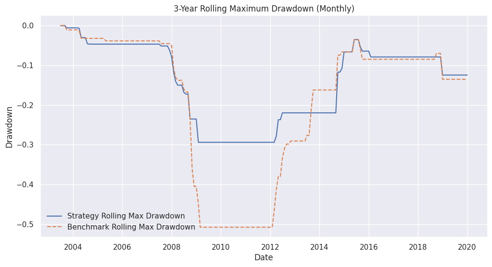
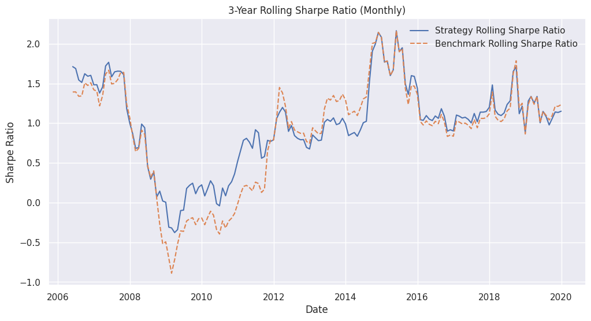
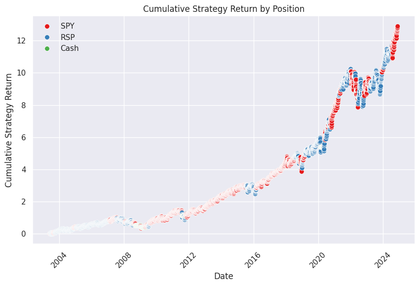

# Lecture 1：策略進階行為分析——滾動夏普比率與滾動最大回撤

在本節課程中，我們完成了衡量策略品質最重要的兩個**風險調整與下行風險指標**：**滾動夏普比率（Rolling Sharpe Ratio）** 與 **滾動最大回撤（Rolling Maximum Drawdown）** 的函數編寫。

透過滾動 3 年期（36 個月）的數據，我們能更全面地觀測策略在不同市場週期下的真實抗震力與回報品質。

<br>

## 1. 滾動夏普比率 (Rolling Sharpe Ratio) 實作

### 核心觀念
夏普比率衡量的是**每承受一單位總風險，能獲得多少超額報酬**。
*   **重用性設計 (Reusable)**：本函數特別加入了 `annualization_factor`（年化因子）參數。本課因使用月資料，預設為 `12`；未來若想切換為日資料，只需將其改為 `252` 即可輕鬆複用。
*   **簡化設定**：在此處我們為了教學流暢度，暫時假設無風險利率（Risk-Free Rate）為 0。*（注意：實務操作上請勿忽略無風險利率）*。

$$\text{Sharpe Ratio} = \frac{\text{Rolling Mean}}{\text{Rolling Std}} \times \sqrt{\text{Annualization Factor}}$$

### Python 程式碼實作
```python
def calculate_rolling_sharpe(df_returns, window=36, annualization_factor=12):
    """
    計算月報酬資料的滾動年化夏普比率（預設視窗 36 個月）
    """
    # 1. 計算指定視窗內的滾動平均報酬率 (Rolling Mean)
    rolling_mean = df_returns.rolling(window=window).mean()
    
    # 2. 計算指定視窗內的滾動報酬率標準差 (Rolling Standard Deviation)
    rolling_std = df_returns.rolling(window=window).std()
    
    # 3. 計算基本夏普並進行年化處理 (乘以年化因子的平方根)
    rolling_sharpe = (rolling_mean / rolling_std) * np.sqrt(annualization_factor)
    
    return rolling_sharpe
```

<br>

## 2. 滾動夏普比率 (Rolling Sharpe Ratio) 實作

### 運算邏輯：
先計算累積報酬率取得淨值曲線 $\rightarrow$ 用 `.rolling().max()` 記錄視窗內曾出現過的最高淨值 $\rightarrow$ 計算目前淨值與最高淨值的距離 $\rightarrow$ 取出該段期間內最慘烈的跌幅 `.rolling().min()`。

```Python
def calculate_rolling_drawdown(df_returns, window=36):
    """
    計算指定視窗內（預設 36 個月）的滾動最大回撤（極端下行風險）
    """
    # 1. 將報酬率加 1 並計算累積乘積，得到滾動淨值曲線 (Cumulative Returns)
    cum_returns = (df_returns + 1).cumprod()
    
    # 2. 追蹤並記錄 36 個月視窗內的歷史最高點 (Rolling Max)
    # min_periods=1 可確保在初始階段也能正常輸出而不報錯
    rolling_max = cum_returns.rolling(window=window, min_periods=1).max()
    
    # 3. 計算每個時間點相對於歷史巔峰的下跌百分比 (Drawdown)
    drawdown = (cum_returns / rolling_max) - 1
    
    # 4. 找出該 36 個月視窗內最糟糕、最慘烈的一次回撤幅度 (Minimum Value)
    rolling_max_dd = drawdown.rolling(window=window, min_periods=1).min()
    
    return rolling_max_dd
```

<br>

## 3. 呼叫函數與運算

我們分別代入「策略月報酬」與「大盤月報酬」來執行上述兩個指標函數

```Python
# 執行夏普比率計算
rolling_strategy_sharpe = calculate_rolling_sharpe(monthly_strategy_returns)
rolling_benchmark_sharpe = calculate_rolling_sharpe(monthly_benchmark_returns)

# 執行最大回撤計算
strategy_rolling_dd = calculate_rolling_drawdown(monthly_strategy_returns)
benchmark_rolling_dd = calculate_rolling_drawdown(monthly_benchmark_returns)
```

<br>

## 4. 數據視覺化與實證圖表分析

### A. 滾動夏普比率對比圖 (Rolling Sharpe Ratio Chart)




<br>

* **2008–2012 金融海嘯期：**
策略的夏普比率完勝大盤（SPY）。這正是波動率濾網（觸發變現機制）在危機中提供的強大風險調整防護力。

* **強勁牛市期（Raging Bull Market）：**
在大盤一路向上狂飆的極端牛市中，策略由於保留了較多現金或進行防禦性調配，夏普比率會出現短暫輕微落後大盤的現象。

* **交易員啟示：**
天底下沒有任何一個策略能在「所有時間」都百分之百擊敗大盤。如果有的話，那它很可能是個騙局（聖杯並不存在，我們要接受合理的策略過渡期）。

### B. 滾動最大回撤對比圖 (Rolling Drawdown Chart)

* **資產保護的終極實證：**
從圖表可以極其震撼地發現，在 2008 年次貸危機爆發的最核心期間，大盤（買入持有者）承受了極其痛苦的巨大回撤，而我們的策略所經歷的最大損失，幾乎只有大盤的一半！

* **保留盈利果實：**
即使在兩個資產都表現不佳的熊市中，波動率濾網依然成功幫我們守住了前幾個週期辛苦賺來的超額利潤（Alpha）。

<br>

## 5. 總結與下一步

* 本次分析展示了該交易策略極其優異的風險輪廓（Risk Profile）。我們不僅創造了高勝率的超額回報，更在市場崩盤時提供了極致的本金保護。

* 下一步（最終章）：我們已經完成了極其漂亮的樣本內（In-Sample）測試。接下來，我們將邁入量化回測最關鍵的考驗——樣本外測試（Out-of-Sample Testing / 盲測）。我們將驗證這套基於波動率濾網的策略，在從未見過的全新歷史數據中，是否依然能發揮同樣驚人的威力！

<br><br>

# 補充：夏普比率（Sharpe Ratio）與進階替代指標

在量化交易與投資組合管理中，評估一個策略好壞不能只看「報酬率有多高」，更要看這個報酬是「冒了多大的風險換來的」。本文深入解析最經典的夏普比率，並介紹三種更貼近實務風險控制的進階改良指標。

<br>

## 1. 什麼是夏普比率（Sharpe Ratio）？

**夏普比率（Sharpe Ratio）**由諾貝爾經濟學獎得主威廉·夏普（William Sharpe）於 1966 年提出，是金融界最常用來衡量**風險調整後報酬率（Risk-adjusted Return）**的經典工具。

它核心的思想是：**在承受每一單位的總風險下，投資組合能幫我賺取多少超額回報？**

### 計算公式
$$Sharpe\ Ratio = \frac{R_p - R_f}{\sigma_p}$$

*   **$R_p$ (Portfolio Return)**：投資組合的預期報酬率。
*   **$R_f$ (Risk-Free Rate)**：無風險利率（通常使用 3 個月期美國國債殖利率）。
*   **$R_p - R_f$**：**超額報酬**（投資人高於定存或美債的獲利幅度）。
*   **$\sigma_p$ (Standard Deviation)**：投資組合報酬率的**標準差（總波動度）**，用來代表總風險。

### 數值解讀標準
*   **$< 0$**：策略表現連無風險資產（如美債）都不如，完全不值得投資。
*   **$0 \sim 1.0$**：表現尚可，但冒的風險與報酬差不多。
*   **$1.0 \sim 2.0$**：**優秀**，每承擔 1% 的風險，能換回 1% 以上的超額回報。
*   **$> 2.0$**：**極其卓越**，通常只有極少數頂尖的量化交易或對沖基金策略能長期維持。

### 夏普比率的致命盲點
1.  **不區分「好波動」與「壞波動」**：公式分母使用的是**總標準差**。標準差把「資產暴漲」與「資產暴跌」都視為同等的風險。如果一個策略經常暴漲、很少暴跌，夏普比率反而會變低，這不符合人性。
2.  **假設報酬率呈常態分佈**：夏普比率假設市場報酬符合傳統的鐘形常態分佈。但現實中金融市場經常發生「黑天鵝事件」或極端肥尾（Fat-tailed）效應，這會導致夏普比率嚴重低估極端暴跌的風險。

<br>

## 2. 三大進階與改良替代指標

為了解決夏普比率的盲點，量化界發展出以下更貼近真實交易痛感的指標：

### I. 索提諾比率（Sortino Ratio）—— 專注於「壞波動」
*   **核心出發點**：投資人討厭的是資產「下跌」，而不是「上漲」。
*   **公式差異**：將夏普比率分母的「總標準差」，替換為**「下行標準差（Downside Deviation）」**，完全忽略資產上漲時的波動。
*   **適用場景**：非常適合評估具備「不對稱回報」的策略（例如：上漲潛力大，但下行控制得很好的波動率濾網策略）。**在實務量化回測中，通常比夏普比率更具參考價值。**

### II. 卡瑪比率（Calmar Ratio）—— 最在乎「歷史最大痛感」
*   **核心出發點**：對於波段交易員或避險基金來說，最讓人睡不著覺的是「歷史上最慘跌了多少」。
*   **計算公式**：
    $$Calmar\ Ratio = \frac{R_p - R_f}{\text{Maximum Drawdown}}$$
*   **公式差異**：分母直接使用**最大回撤（Maximum Drawdown, MDD）**。
*   **適用場景**：極度重視「資金回撤保護」的指標。如果兩個策略回報相同，但一個最大回撤是 10%、另一個是 40%，前者的卡瑪比率會極高。非常適合用來評估高槓桿期貨交易、量化 CTA 策略。

### III. 歐米加比率（Omega Ratio）—— 破除常態分佈迷思
*   **核心出發點**：市場報酬率根本不是常態分佈，有很多極端大賺或大賠的日子。
*   **運作原理**：不使用標準差，而是直接將整個收益率分佈曲線切開，計算**「賺錢的機率面積」除以「賠錢的機率面積」**。
*   **適用場景**：完整保留了收益分佈的所有高階統計特徵（如偏態和峰態），能精準抓出策略是否隱藏了「黑天鵝大賠」的隱患，是目前量化對沖基金界公認更嚴謹的指標之一。

<br>

## 3. 總結：指標大比拼與使用建議

| 指標名稱 | 分母（代表的風險定義） | 核心關注重點 | 最適合應用的場景 |
| :--- | :--- | :--- | :--- |
| **夏普比率 (Sharpe)** | 總標準差 (總波動度) | 整體資產的穩定度 | 評估傳統大盤指數基金（如 SPY）、股債平衡型組合。 |
| **索提諾比率 (Sortino)** | 下行標準差 (僅計算下跌波動) | 避開壞波動，保留好上漲 | 評估主動型成長基金、配對交易策略、不對稱期權策略。 |
| **卡瑪比率 (Calmar)** | 最大回撤 (歷史最大跌幅) | 歷史最極端的虧損壓力 | 評估高槓桿期貨交易、量化 CTA 策略，或需要對客戶負責的代操策略。 |

### 交易員實務操作建議
在建立或優化量化策略時，**切忌單一指標迷信**。建議將三者結合觀看：
1.  用 **夏普比率** 看綜合穩定度。
2.  用 **索提諾比率** 檢查策略是否成功保留了上漲潛力並隔離了下跌風險。
3.  用 **卡瑪比率** 檢視策略在面臨類似 2008 金融海嘯等極端危機時的真實抗震力。

<br><br>

# Lecture 2：樣本外測試（Out-of-Sample）與策略有效性辯證

在本節課程中，我們步入了量化回測中最關鍵的階段：**樣本外測試（Out-of-Sample Testing / 盲測）**。我們將使用策略在開發時「從未見過」的全新歷史數據（2020 年至今），來檢驗這套結合波動率濾網的配對交易策略是否具備真實的泛化能力（Generalization）。

<br>

## 1. 樣本外測試（OOS）設定與實作

為了模擬真實的交易接續，在執行樣本外回測前，必須確保**初始持倉狀態（Initial Position）與樣本內結束時完全一致**。

### 🔍 提取接續持倉狀態
檢查樣本內（In-Sample）回測結果 `result_with_vol_filter` 的最後一筆觀測值，發現其最終持倉狀態為 `RSP`。因此，在樣本外測試中，我們必須手動將初始持倉指定為 `'RSP'`。

### Python 實作程式碼：執行 OOS 回測
```python
# 1. 隔離出 2020 年至今的樣本外數據 (Out-of-Sample)
df_oos_prices = df_prices.loc["2020":].copy()

# 2. 提取樣本內的最終持倉作為 OOS 的初始狀態
# (經檢驗最後一個位置字串為 'RSP')
initial_pos_oos = "RSP"

# 3. 呼叫回測函數執行樣本外盲測
os_backtest_result = backtest_zscore_strategy_with_volatility(
    df=df_oos_prices,
    z_col=f"rolling_z_score_21_diff_Z", # 保持相同 1 個月 Z-Score 欄位
    z_thresh=1.5,
    spy_ret_col="SPY_Return",
    rsp_ret_col="RSP_Return",
    vol_col="SPY_rolling_volatility",
    high_vol_thresh=0.32,
    low_vol_thresh=0.28,
    initial_pos=initial_pos_oos,       # 帶入接續持倉 RSP
    plot=True
)

# 4. 輸出樣本外累積報酬率
final_oos_strategy_ret = os_backtest_result['cum_strategy_return'].iloc[-1]
final_oos_benchmark_ret = os_backtest_result['cum_benchmark_return'].iloc[-1]

print(f"樣本外 (5年) 策略累積報酬率: {final_oos_strategy_ret:.2%}")
print(f"樣本外 (5年) 大盤累積報酬率: {final_oos_benchmark_ret:.2%}")
```

<br>

## 2. 實證結果與「策略失效？」的關鍵辯證

### 令人失望的初步數據？
在約 5 年的樣本外期間，策略對比大盤的超額回報（Alpha）僅有約 3.18%。從統計學角度來看，這點微幅的領先很難斷定它在統計上顯著優於
大盤（Benchmark）。

### 圖表行為拆解（為什麼落後？）
透過繪製累積報酬曲線與持倉輪廓圖，我們可以清晰辨識出策略在不同危機中的動態：

1. **2020 Covid 疫情大崩盤：** 波動率濾網表現極佳！成功觸發並強制策略全面清倉並轉向現金（In Cash），完美避開第一波大跌。  

2. **V型反轉的盲點：** Covid 帶來的市場反彈速度極其迅猛，而由於當時市場波動率仍處在高位，策略留在現金的時間稍長，錯過了最初幾天的暴漲，導致部分 Alpha 遭到侵蝕。  

3. **2022 年雄市：** 策略抗震能力良好，表現穩健。 

4. **近年落後原因：** 策略在今年切換到了等權重（RSP）持倉，然而大盤此後主要由市值權重（SPY，如大型科技巨頭）主導暴漲，導致策略做出錯誤的輪動判斷。

<br>

## 3.關鍵思考：這代表我們的策略失效了嗎？

針對「樣本外表現平平」提出了非常精闢且符合業界實務的量化觀點：

* **我們沒有過度擬合（Overfitting）：** 許多機器學習模型在 OOS 崩盤是因為過度擬合。但本策略我們從頭到尾沒有在 OOS 階段重新訓練或刻意挑選（Cherry-picking）參數，我們使用的是極其簡單、基於資產回報差（Return Differential）的穩定模式。

* **39% 規律的機率體現：** 根據我們在做出的「滾動 3 年績效統計」，該策略在歷史上的勝率是 61%。這意味著它本来就有 39% 的時間會出現平庸或落後大盤的表現。這 5 年的樣本外期間，正好落在了這 39% 的常態分佈概率中。 

* **大數法則的信心：** 講師強調，對他而言，「滾動 3 年分析」的權重大於「單一 OOS 區間」。只要你交易的時間足夠長，整體的表現終究會向長期統計數據靠攏。而且即便在不佳的年份，策略也僅是少賺，並未帶來災難性的本金虧損。

## 4. 20 年完整數據統計結果

合併近年糟糕的樣本外數據後，拉長至 20 年的整體大盤實證數據顯示：



### 總超額報酬（Alpha）依舊驚人：
總累積超額回報高達 480%。

### 長期勝率不降反升：
在所有滾動 3 年期間，策略擊敗大盤的機率維持在 63% 的極高水準。

### 最大報酬優於大盤：
策略的最佳 3 年年化報酬率甚至超越了純死抱 SPY 的高點。

### 下行防禦完全驗證：
最慘烈的 3 年期間，策略平均每年僅微幅修正，成功將最大回撤與風險控制在極佳的範疇。